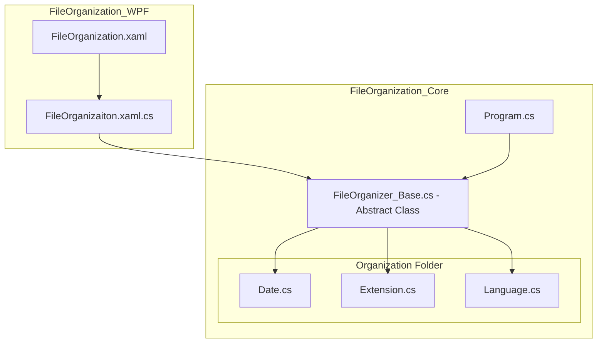

## File Organizer
> 폴더 내 파일을 확장자, 날짜, 파일명 언어 기준으로 자동 정리하는 프로그램 
> 2026. 3
 

### FileOrganization_Core
<b>파일 정리의 핵심 로직을 담당하는 콘솔 기반 프로그램입니다.</b> 
사용자가 입력한 폴더 경로와 정리 기준을 바탕으로 파일을 분석하고, 기준에 따라 폴더를 생성한 뒤 파일을 이동시킵니다. 

- Program: 프로그램이 실행되는 Main 함수가 포함되어 있으며, 사용자로부터 콘솔로 파일 주소와 정리 기준을 입력받습니다.
- FileOrganizeBase: 파일 정리 기능을 공통으로 정의한 추상 클래스입니다.
  
<Organization 폴더>
- Date: 날짜를 기준으로 파일을 정리합니다.
- Extension: 확장자를 기준으로 파일을 정리합니다
- Language: 파일명 언어를 기준으로 파일을 정리합니다.
 

### FileOrganization_WPF
<b>Core의 기능을 손쉽게 Windows GUI 환경에서 사용할 수 있도록 확장한 프로그램입니다.</b>

- FileOrganization.xaml: Windows GUI를 통해 프로그램의 인터페이스를 정의한 파일입니다.
- FileOrganization.xaml.cs: 인터페이스에 연결된 메서드를 구현한 스크립트 입니다.
